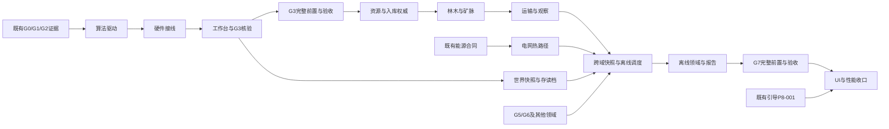

# 项目改进总计划（2026-10-08）

**状态：B40～B46增量实施已完成并保存证据；B50独立UI/文档单元已验证；B47/B48/B49/B50整批均有已交付子集及未就绪前置，剩余依赖阻塞。当前功能与验收边界见[证据索引](FunctionalEvidenceIndex-20261009.md)。用户批准的b07最小唯一归属核心已在B43交付，B44追加试玩初值及真实生产通过102项原生验证；B45两类真实生产运输闭环及UI通过114项原生验证，见[实施证据](../../openspec/changes/b45-p4011-p4014-p4015-p4016-production-transport-loop/evidence/implementation-20261008.md)；完整b07与阶段门仍保留边界。104项实施任务实际状态以各change的tasks.md为准。**

本计划只组织本次评估提出的改进。任务ID、前置与阶段状态仍以[用户维护的开发任务表](../GameDesign/05-开发计划/第一版开发任务表.xlsx)为准；本文件不是第二份权威任务台账，也不是完整第一版剩余工作量估算。

B47已实现格式、安全保存、区域/物理操作、宿主组合、隔离候选事务及保存退出，去重354项原生测试通过，含实际1920×1080界面和文件IO；完整跨域与正常菜单综合往返待B48/B49，见[增量04证据](../../openspec/changes/b47-p7002-p7003-p7004-p7011-world-save-flow/evidence/segment-04-world-transaction-and-exit.md)。核心验证后先实施B48→B49，再回B47综合复验，随后B50；B47整批尚未完成。

## 授权与目标

用户依次确认：全量详细规划（C）、复用现有架构必要时局部重构（A）、十一批方向和验收方案；UI仅检查1920×1080，Prefab节点布局仍考虑适配。依据：[决策摘要](ImprovementPlanDecisionSummary-20261008.md)、[DEC-204/205](../GameDesign/90-设计管理/决策记录.md)。

交付包括11份proposal、11份design、11份spec、11份tasks及本索引。目标是修通正式算法运行、两类真实生产/运输/入库、安全存读档与完整离线接入，并优化电网和UI热点。规划交付后，用户于2026-10-08明确授权apply与范围内的代码/资产实施；任务表仍只读，不操作Git索引。运行验证使用用户指定并已核验工程身份的UnitySkills8091。

## 批次与估算

每批2～5个原始任务能力归属，正文保留完整任务ID与原始依赖快照。P4部分任务只覆盖林木/矿脉子集；P8文案只覆盖本次改动界面，不能将原任务全量标完成。

| 变更 | 原始任务映射 | 计划内前置 | 实施项 | 增量人时 |
|---|---|---|---:|---:|
| [B40 算法正式运行驱动](../../openspec/changes/b40-p3003-p3005-p3007-p3008-algorithm-runtime-drive/proposal.md) | P3-003、P3-005、P3-007、P3-008 | 外部合同核验 | 9 | 46～86 |
| [B41 传感器与效应器生命周期](../../openspec/changes/b41-p2005-p2007-p3006-hardware-runtime-wiring/proposal.md) | P2-005、P2-007、P3-006 | B40 | 9 | 44～82 |
| [B42 算法工作台可用性与闭环](../../openspec/changes/b42-p3010-p3011-p3013-p3014-algorithm-workbench-closure/proposal.md) | P3-010、P3-011、P3-013、P3-014 | B40、B41 | 9 | 38～74 |
| [B43 资源权威与入库结算](../../openspec/changes/b43-p4001-p4010-p4012-p4013-resource-settlement/proposal.md) | P4-001、P4-010、P4-012、P4-013 | B40、B41 | 10 | 56～108 |
| [B44 林木与矿脉真实作业](../../openspec/changes/b44-p4002-p4003-p4009-p4017-forest-mineral-production/proposal.md) | P4-002、P4-003、P4-009、P4-017 | B41、B43 | 10 | 54～104 |
| [B45 运输与生产观察](../../openspec/changes/b45-p4011-p4014-p4015-p4016-production-transport-loop/proposal.md) | P4-011、P4-014、P4-015、P4-016 | B42、B43、B44 | 9 | 44～86 |
| [B46 电网热路径优化](../../openspec/changes/b46-p5006-p5009-p5010-energy-hotpath/proposal.md) | P5-006、P5-009、P5-010 | 外部合同核验 | 9 | 40～80 |
| [B47 安全快照与存读档入口](../../openspec/changes/b47-p7002-p7003-p7004-p7011-world-save-flow/proposal.md) | P7-002、P7-003、P7-004、P7-011 | B40、B41、B42 | 10 | 58～112 |
| [B48 跨域快照与离线调度](../../openspec/changes/b48-p7005-p7006-p7007-offline-event-foundation/proposal.md) | P7-005、P7-006、P7-007 | B43、B44、B45、B46、B47 | 9 | 52～100 |
| [B49 离线领域推进与回归报告](../../openspec/changes/b49-p7008-p7009-p7010-p7012-offline-domain-reports/proposal.md) | P7-008、P7-009、P7-010、P7-012 | B48 | 10 | 62～116 |
| [B50 UI加载、性能与证据收口](../../openspec/changes/b50-p8007-p8011-p8012-ui-performance-closure/proposal.md) | P8-007、P8-011、P8-012 | B42、B45、B46、B49 | 10 | 52～100 |
| **合计** | **40个不同原始任务ID的改进/补齐范围** | 外部依赖另计 | **104** | **546～1048** |

估算采用单人有效工程工时，含各批实现、相关测试与证据整理；不含等待、未列入范围的农业/水泵/经济/制造/成长、正式美术生产与全G8验收。各项上限≤18小时，依赖导致的等待不是工时。按原每周20小时投入，仅本计划算术折算约27.3～52.4工作周；这不是上线日期，外部依赖可能延长日历周期。本轮已于2026-10-08获得实施授权并开始执行；上述工程人时为原规划估算，不是实际消耗或交付日期承诺。

### 每批文档入口

| 批次 | 方案 | 设计 | 规格 | 实施任务 |
|---|---|---|---|---|
| B40 | [proposal](../../openspec/changes/b40-p3003-p3005-p3007-p3008-algorithm-runtime-drive/proposal.md) | [design](../../openspec/changes/b40-p3003-p3005-p3007-p3008-algorithm-runtime-drive/design.md) | [spec](../../openspec/changes/b40-p3003-p3005-p3007-p3008-algorithm-runtime-drive/specs/production-algorithm-driving/spec.md) | [tasks](../../openspec/changes/b40-p3003-p3005-p3007-p3008-algorithm-runtime-drive/tasks.md) |
| B41 | [proposal](../../openspec/changes/b41-p2005-p2007-p3006-hardware-runtime-wiring/proposal.md) | [design](../../openspec/changes/b41-p2005-p2007-p3006-hardware-runtime-wiring/design.md) | [spec](../../openspec/changes/b41-p2005-p2007-p3006-hardware-runtime-wiring/specs/hardware-runtime-lifecycle/spec.md) | [tasks](../../openspec/changes/b41-p2005-p2007-p3006-hardware-runtime-wiring/tasks.md) |
| B42 | [proposal](../../openspec/changes/b42-p3010-p3011-p3013-p3014-algorithm-workbench-closure/proposal.md) | [design](../../openspec/changes/b42-p3010-p3011-p3013-p3014-algorithm-workbench-closure/design.md) | [spec](../../openspec/changes/b42-p3010-p3011-p3013-p3014-algorithm-workbench-closure/specs/algorithm-workbench-production-closure/spec.md) | [tasks](../../openspec/changes/b42-p3010-p3011-p3013-p3014-algorithm-workbench-closure/tasks.md) |
| B43 | [proposal](../../openspec/changes/b43-p4001-p4010-p4012-p4013-resource-settlement/proposal.md) | [design](../../openspec/changes/b43-p4001-p4010-p4012-p4013-resource-settlement/design.md) | [spec](../../openspec/changes/b43-p4001-p4010-p4012-p4013-resource-settlement/specs/resource-transfer-settlement/spec.md) | [tasks](../../openspec/changes/b43-p4001-p4010-p4012-p4013-resource-settlement/tasks.md) |
| B44 | [proposal](../../openspec/changes/b44-p4002-p4003-p4009-p4017-forest-mineral-production/proposal.md) | [design](../../openspec/changes/b44-p4002-p4003-p4009-p4017-forest-mineral-production/design.md) | [spec](../../openspec/changes/b44-p4002-p4003-p4009-p4017-forest-mineral-production/specs/forest-mineral-production/spec.md) | [tasks](../../openspec/changes/b44-p4002-p4003-p4009-p4017-forest-mineral-production/tasks.md) |
| B45 | [proposal](../../openspec/changes/b45-p4011-p4014-p4015-p4016-production-transport-loop/proposal.md) | [design](../../openspec/changes/b45-p4011-p4014-p4015-p4016-production-transport-loop/design.md) | [spec](../../openspec/changes/b45-p4011-p4014-p4015-p4016-production-transport-loop/specs/production-transport-observation/spec.md) | [tasks](../../openspec/changes/b45-p4011-p4014-p4015-p4016-production-transport-loop/tasks.md) |
| B46 | [proposal](../../openspec/changes/b46-p5006-p5009-p5010-energy-hotpath/proposal.md) | [design](../../openspec/changes/b46-p5006-p5009-p5010-energy-hotpath/design.md) | [spec](../../openspec/changes/b46-p5006-p5009-p5010-energy-hotpath/specs/energy-hotpath-equivalence/spec.md) | [tasks](../../openspec/changes/b46-p5006-p5009-p5010-energy-hotpath/tasks.md) |
| B47 | [proposal](../../openspec/changes/b47-p7002-p7003-p7004-p7011-world-save-flow/proposal.md) | [design](../../openspec/changes/b47-p7002-p7003-p7004-p7011-world-save-flow/design.md) | [spec](../../openspec/changes/b47-p7002-p7003-p7004-p7011-world-save-flow/specs/world-safe-snapshot-flow/spec.md) | [tasks](../../openspec/changes/b47-p7002-p7003-p7004-p7011-world-save-flow/tasks.md) |
| B48 | [proposal](../../openspec/changes/b48-p7005-p7006-p7007-offline-event-foundation/proposal.md) | [design](../../openspec/changes/b48-p7005-p7006-p7007-offline-event-foundation/design.md) | [spec](../../openspec/changes/b48-p7005-p7006-p7007-offline-event-foundation/specs/offline-event-foundation/spec.md) | [tasks](../../openspec/changes/b48-p7005-p7006-p7007-offline-event-foundation/tasks.md) |
| B49 | [proposal](../../openspec/changes/b49-p7008-p7009-p7010-p7012-offline-domain-reports/proposal.md) | [design](../../openspec/changes/b49-p7008-p7009-p7010-p7012-offline-domain-reports/design.md) | [spec](../../openspec/changes/b49-p7008-p7009-p7010-p7012-offline-domain-reports/specs/offline-domain-settlement-report/spec.md) | [tasks](../../openspec/changes/b49-p7008-p7009-p7010-p7012-offline-domain-reports/tasks.md) |
| B50 | [proposal](../../openspec/changes/b50-p8007-p8011-p8012-ui-performance-closure/proposal.md) | [design](../../openspec/changes/b50-p8007-p8011-p8012-ui-performance-closure/design.md) | [spec](../../openspec/changes/b50-p8007-p8011-p8012-ui-performance-closure/specs/ui-performance-evidence-closure/spec.md) | [tasks](../../openspec/changes/b50-p8007-p8011-p8012-ui-performance-closure/tasks.md) |

## 顺序与依赖

优先顺序为B40→B41→B42→B43→B44→B45→B46→B47→B48→B49→B50，按单窗口依次执行。B46无本计划内强制前置，可在其他批次确有外部阻塞且其已有能源合同就绪时前移；本次不因此自动派发或并行实施。



图中是能力/验收依赖，不能用文档完成替代运行证据。设计可以先定稿，实施只领取依赖已满足的独立单元；已有历史门若确有有效证据则复用核验，不因任务表尚未手动登记就重复造实现。

### 外部依赖与残余范围

| 依赖 | 为什么需要 | 本计划如何处理 |
|---|---|---|
| G0-001/G1-001/G2-001 | 现有运行与输入/身份/导航基础须有真实证据 | B40实施前核对来源、版本和未覆盖项，不能由P任务勾选推定阶段通过 |
| G3-001及P3-009/P3-012/P3-015 | 资源阶段以真实算法配置闭环为前置 | 复用模板链，B40/B41/B42补运行证据；缺项留待原任务，不自动更改工作簿 |
| b07、P4-018/P4-019/P4-020、P6-015 | 货物唯一归属、物理代理、传送带、下游拉取 | 接其已确认接口；禁止B43再造第二套物流；缺实现时记录相关集成待依赖 |
| P4-004～P4-008等农业/水泵及完整P4-017 | 完整G4要求超出林木/矿脉的原始前置 | B43提供可复用接口；B44/B45只验收明确子集；完整G4仍等原任务完成 |
| P5商品/出售/升级/补给、G5-001 | 完整经济状态与存档/离线消耗 | B46只优化已具备能源；B48必须接真实经济快照，不以空余额模块替代 |
| P6施工制造/任务成长、G6-001 | 完整生产状态快照与离线白名单 | B48/B49定义适配合同及验证，具体域未完成前不能宣称完整离线 |
| 正式开局内容与B47入口 | 玩家正常新建/继续不能靠GM造机器 | 中间集成可准备初始数据，综合玩家链用正式配置并完整复验B42/B45 |
| P8-001、P6-010/P6-011与G7 | P8性能/文案收口的原始前置 | B50保留依赖；局部基准可先设计，全批完成不能提前登记 |
| 用户提供植被/切割工具与正式资产 | 逻辑测试不能替代批准视觉素材 | 分清逻辑/灰盒证据与正式视觉，缺资产不虚构正式验收 |

不自动扩展本次计划去实现所有上述外部内容；这保持用户批准的增量范围。它们不会阻止本次文档交付，但会阻止依赖它们的实现/整体验收。需要另批实施时沿用原任务与现有OpenSpec，不创建并行权威表。

## 共用实现合同

### 生命周期与权威

- 世界/区域/机器拥有领域服务和推进；UI只读模型或发命令，关闭UI不停止世界。
- 算法图与模板、草稿、已应用配置、运行状态分离。首次激活、参数应用、结构重启和存档恢复有不同触发语义；失败保持旧实例，恢复不重复Startup。
- 传感器只读允许字段，效应器命令进入真实权威队列；B41接线不伪造尚未实现生产状态。
- 资源整数单位、预留、实际提交、货物拥有者和未解决责任有唯一来源。视觉/物理代理不反推数量。
- 保存按安全边界捕获不可变DTO，后台只处理快照；每槽串行写入，旧写完成不能清掉新变化。
- 离线按正式同刻顺序与有效事件推进，保留阻塞与幂等事务；禁止按离线时长直接乘资源收益。

### UI：唯一运行验收分辨率与结构适配

运行/截图仅检查 **1920×1080**；不增加其他分辨率或宽高比验收。结构检查仍必须覆盖：

1. UIForm根全屏Stretch、零offset；根不自建Canvas/CanvasScaler，GF根Canvas统一使用AppSettings.DesignResolution。
2. HUD按对应边缘锚定、模态居中、背景/遮罩拉伸；pivot与定位语义一致，不能用固定1920屏幕坐标模拟边缘对齐。
3. 容器划分固定区和伸展区；LayoutGroup负责的轴由LayoutElement提供尺寸约束，脚本不争夺同一轴。
4. 列表viewport/content拉伸与滚动方向一致，动态文本有明确约束；只实例化需要显示的页面或行。
5. 契约、生成字段、Prefab与手写生命周期同步变更。结构门证明布局意图，1920×1080运行门证明本次实际交互，两者不互相替代。

该约束已同步到[GF UI规范](GF-UI-Standards/06-适配可访问性与性能规范.md)；不改现有视觉方向。

## 验收矩阵

| 门 | 做法 | 通过证据 |
|---|---|---|
| 规则与领域 | EditMode：版本、顺序、暂停原因、预留/转移守恒、保存恢复、离线确定性 | 原生XML、输入与断言；无重复ID/数量/奖励 |
| 正式驱动 | PlayMode：经正式宿主和输入/命令执行 | 测试不自行创建缺失正式服务、不手动Pump补线，真实任务结果及诊断责任链 |
| 玩家综合链 | 正常菜单新建/继续→装配/部署→算法→作业→运输入库→保存退出重进 | 无GM/直接改余额/伪造完成；依赖完整后复验，缺失时明确记录 |
| 异常恢复 | 断电、无路、满载、绑定失效、取消、应用失败、写入失败、损坏、离线中断 | 资源/责任保留，失败可观察且能按条件恢复 |
| UI | 1920×1080关键状态截图与交互；独立结构适配检查 | 无遮挡裁切，入口可操作，关闭/迟到回调后焦点和输入正确 |
| 性能 | 独立Development Player，10/50/100机器；50台60分钟；UI100次开关 | 固定硬件/构建/种子，p50/p95/p99、GC、UI延迟、内存/队列/订阅走势 |
| 文档健康 | OpenSpec逐变更strict、链接/原始ID/任务格式检查 | 11份变更均通过；不勾选尚未实施的任务 |

性能硬门区分两类：稳定电网推进及无变化的常驻刷新消除可避免持续分配；状态变更/快照/打开UI的有意分配单独记录。缓存不能篡改已经发布的快照。预热后同等状态的对象、订阅、队列与内存不得持续增长；绝对CPU/GPU/内存预算由首轮实测冻结，当前没有性能通过结论。

离线一致性比较永久ID、全局余额、实体库存、任务/行为阶段、算法变量/延迟/事件、能源、成长和已提交标记；不能只对总收益。重看报告不触发结算。G3/G4/G7/G8通过仍需完整原前置与用户阶段验收。

## 检查命令与证据组织

未来实施时，在核验主工程身份和占用后执行：

```powershell
python tools/run_project_checks.py --port <实际核验的主工程端口>
python tools/audit_framework_purity.py --product-profile tools/audit_product_profile.json
python tools/audit_project_boundaries.py
openspec validate <本批完整change-id> --strict
```

Unity测试使用EditMode/PlayMode的明确类名或本批测试程序集过滤，保留原生XML；拟新增测试名均是实现任务，不得报告为已运行。结构/序列化变更退出Play Mode后普通编译，不用FSR代替编译验证。

每批实施证据放该change的evidence目录，包含版本/环境/时间、Scenario映射、命令/结果、必要1920×1080截图、性能数据、未覆盖项与回滚验证。本次规划校验单独见[文档校验记录](ImprovementPlanValidation-20261008.md)，不创建假的运行证据。

## 风险与回退

| 风险 | 责任与处置 |
|---|---|
| 外部领域尚未实现 | 客户端在相应批的依赖门列明；不以临时替身过生产验收，继续其他无依赖授权单元 |
| b07或其他既有共识冲突 | 先按权威来源核对；真实冲突只暂停受影响单元并提差异，不推翻整个规划 |
| 数据格式/安全点错误 | B47/B48采用隔离候选恢复、不可变快照、事务标记与有效备份；不让失败覆盖最后有效档 |
| 运行驱动双推进/回调重入 | B40/B41明确唯一宿主、结果缓冲、稳定迭代与生命周期版本 |
| UI拆分导致迟到打开和泄漏 | B42/B50保留请求版本/取消、对称退订与100次开关验证 |
| 性能优化破坏优先级/结果 | B46/B50同场景规则对照与基准共同通过，不能降低业务精度换帧率 |
| 需新框架或修改ScriptsBuiltin | 不在本批授权方案内，出现需求时说明原因并暂停相关实现 |

具体回退按每批design.md执行；没有用户手动触发不进行Git暂存/提交。文档估算不是实现授权，未开始的任务保留未勾选。

## 快速执行候选检查与后续入口

本轮工作包含跨域依赖、生命周期与验收判断，由主对话完成，不委派子agent。未来已冻结且低风险的扫描/配置/回归可按RapidExecution六项门槛拆短包，原专业负责人保留复核；不得因本计划存在自动入实施队列。

获实施授权后的首个入口为 **B40前置核验**：核对既有G0/G1/G2与当前编译/运行状态，准备暴露正式驱动缺口的测试，再按B40任务推进。若已有证据充分则复用，不重新要求用户批准已冻结的局部技术细节。

B48已实现资源/运输、林矿、能源、公共缓存、跨域门和独立调度/检查点，去重176项原生测试与健康5/5通过，见[增量04](../../openspec/changes/b48-p7005-p7006-p7007-offline-event-foundation/evidence/segment-04-scheduler-and-domain-contracts.md)。完整经济、任务成长和日常补给未交付，B48整批及P7-005/P7-006仍未完成；依赖阻塞让出执行位，继续B49可执行单元。

B49报告/原子检查点合同去重91项原生验证通过，见[增量01](../../openspec/changes/b49-p7008-p7009-p7010-p7012-offline-domain-reports/evidence/segment-01-report-and-checkpoint-contracts.md)；正式完整离线仍待全部真实提供者。返回B47已核对正式开局配置缺失，整批依赖阻塞，见[增量05](../../openspec/changes/b47-p7002-p7003-p7004-p7011-world-save-flow/evidence/segment-05-dependency-recheck.md)。继续B50独立测试准备、结构检查及证据范围，不伪称G7/G8。

B50独立单元51/51原生回归与健康5/5通过，五页500次开关、1920×1080控件命中与结构已验证，见[增量01](../../openspec/changes/b50-p8007-p8011-p8012-ui-performance-closure/evidence/segment-01-ui-lifecycle-and-evidence.md)。全量门1保留Warehouse六项基线；联合Player/长时/正式文案与G8未完成。所有安全可执行子集已交付，后续按B48→B49→B47→B50恢复真实依赖；无Git提交/xlsx改写。
