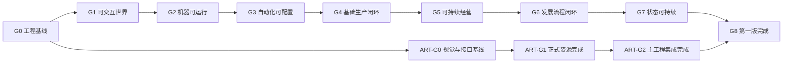

# 《星际拓荒：自动纪元》第一版开发路线总览

> 状态：开发任务结构与Excel任务台账均已完成
> 当前项目：`D:\unity\UnityProject\stellar-frontier-auto-era`
> 框架来源：AI-Friendly-Project（GF_X）
> Unity版本：2022.3.62f3
> 开发投入基准：个人开发每周约20小时；美术资源制作单独统计
> 本文不是OpenSpec实现方案，也不包含测试用例。

## 目的

本文回答三个问题：

1. 为完成第一版，开发需要依次建立哪些可运行能力。
2. 哪些程序、UI、灰盒、特效、声音和配置工作可以并行推进。
3. 每个阶段达到什么结果后，关键路径才能进入下一阶段。

具体任务台账使用任务ID、依赖任务和可并行组维护。每个任务的预计上限不得超过18小时；超过时必须在开始开发前再次拆分。

## 框架复用边界

### 直接复用

- `Launch`、`FrameworkReadyProcedure`与`IFrameworkStartupProcedure`启动链。
- `AppConfigs`及Procedure、DataTable、Config、Language加载配置。
- `GameData` Excel源文件、DataTable代码生成和刷新工具。
- `UIFormBase`、`UIItemBase`、`UIParams`、UITable与UIGroupTable。
- `EntityBase`、实体分组、对象池与资源加载。
- `GF.Sound`、SoundGroupTable及基础音量／静音能力。
- UniTask异步接入、资源构建、诊断和框架纯度审计。

### 项目必须新增

- 自动纪元业务启动Procedure、业务场景和项目目录。
- 项目InputModule与可替换输入Provider；产品代码不得直接读取`UnityEngine.Input`。
- 世界时间、永久实例ID、对象注册、区域和三类友方对象。
- 机器、组件、任务队列、算力、导航和作业点。
- 节点算法运行时、编辑器、算法库和诊断。
- 生产、农业、物流、仓库、经济、能源、制造、任务和成长。
- 三槽存档、滚动备份、确定性离线推进和离线报告。
- 全部项目UI、灰盒预制体、配置、文案、特效与声音资源。
- 独立美术项目、Art Bible、正式场景与对象资源、动画、交互动效、UI视觉以及分批导入验收链。

### 禁止修改

- 产品业务不得进入`Assets/Game/ScriptsBuiltin/`。
- 不把ScriptableObject当运行时数据库。
- 不绕过框架输入抽象、UI、实体、数据和资源接入边界。
- 不为第一版提前实现战斗、实际探索、通信调度、维修、跨区域能源和高级调度。

## 总体规模

当前共拆分166项开发与阶段验收任务，所有任务预计上限均不超过18小时。

| 口径 | 预计工时 |
|---|---:|
| 程序预算：客户端、UI、配置和集成 | 1194～1866小时 |
| 美术资源预算：灰盒、正式资源、动画、VFX、UI视觉、声音与集成 | 468～730小时 |
| 全部工作合计 | 1662～2596小时 |
| 按每周20小时计算的程序工作量 | 约60～93周 |

这与早期120～160小时设想存在数量级差异。原因不是框架没有作用，而是第一版同时包含节点编辑器、确定性自动化、多个管理界面、存档与离线推进以及完整正式美术生产链。框架降低了通用启动、数据、UI、实体、声音和资源接入成本，但不会自动提供游戏业务或正式美术资源。

开发过程中不得通过压缩估算来维持旧预算。如果必须缩短周期，应重新削减版本范围；优先后置表现和管理便利，不能砍掉“算法—机器—生产—诊断”的核心闭环。

## 开发阶段

| 阶段 | 任务数 | 工时范围 | 阶段目标 |
|---|---:|---:|---|
| 阶段0 工程准备 | 14 | 98～166小时 | 从Launch进入业务场景，项目InputModule、GF数据、GF.UI和GF.Entity接入完成 |
| 阶段1 世界与对象 | 10 | 98～156小时 | 初始区域、三类对象、选择、现场交互、占地和作业点可用 |
| 阶段2 机器运行 | 13 | 140～216小时 | 机器可组装、激活、移动、排队、消耗算力并被中枢观察 |
| 阶段3 算法系统 | 16 | 176～268小时 | 节点算法可编辑、验证、应用、运行、保存模板并诊断 |
| 阶段4 生产物流 | 18 | 184～288小时 | 农业与三种直接资源可自动生产、运输并正确入库 |
| 阶段5 经济能源 | 15 | 156～244小时 | 购买、出售、升级、发电、蓄电、缺电与恢复闭环 |
| 阶段6 建造制造成长 | 15 | 152～240小时 | 建造、制造、任务、经验、图纸与警报形成发展流程 |
| 阶段7 存档离线 | 13 | 144～218小时 | 复杂运行状态可安全保存并按真实条件离线推进 |
| 阶段8 引导与版本终点 | 15 | 152～234小时 | 新存档可完成引导、发展至中枢3级并解锁探索入口 |

程序阶段之外另有一条正式美术并行路线。表内47项美术预算任务中，37项属于以下独立美术路线，其余10项是嵌入程序阶段的灰盒、技术美术和基础声音工作。

| 美术阶段 | 任务数 | 工时范围 | 阶段目标 |
|---|---:|---:|---|
| 并行美术0 视觉预研 | 10 | 80～128小时 | 确认视觉方向、场景与资源路线、导入规则，并完成代表性资源贯通验证 |
| 并行美术1 资源制作 | 18 | 196～300小时 | 场景、3D、材质、动画、VFX和UI视觉在独立项目内并行制作与专业验收 |
| 并行美术2 导入验收 | 9 | 86～138小时 | 按领域分批导入主工程，完成状态绑定、性能与一致性收口 |

## 关键路径

阶段不是要求所有人或所有工作流完全串行。程序主线与美术路线在`G0`后并行推进；正式资源按场景、机器组件、建筑资源点、动画VFX和UI分批导入，只有最终`G8`同时等待程序主线和`ART-G2`。

## 各里程碑验收门

### G0 工程基线

从`Launch`进入空业务场景；项目Procedure、InputModule、世界时钟、永久ID、GF数据、GF.UI、GF.Entity和分组配置共同运行。框架纯度审计不报告产品业务写入`ScriptsBuiltin`。

### G1 可交互世界

玩家能够在初始区域选择机器、建筑和资源点，打开对应现场界面，查看公开摘要；建造预览、占地、作业点和等待点规则能够运行。

### G2 机器可运行

一台轮式机器能够从机器库组装、部署、现场激活、申请作业点、自动寻路、执行排队任务，并在中枢显示任务、算力与异常状态。

### G3 自动化可配置

玩家能够从算法库应用模板、绑定具体传感器与效应器、运行算法、修改参数并查看责任链；无效算法不能破坏仍在运行的旧实例。

### G4 基础生产闭环

至少两类资源点能够由机器自主生产、采集、装载、运输、卸载和入库；缓存满、资源不足、路径受阻和缺少转移能力都能被解释和恢复。

### G5 可持续经营

玩家能够通过生产取得资源，通过商店、出售与升级消费资源；区域电网可以发电、蓄电、缺电停机并从无燃料状态依靠太阳能恢复最低生产。

### G6 发展流程闭环

玩家达到中枢2级后能够完成蓄电、建造工坊、制造组件和供电扩张；任务、经验、图纸、奖励和警报都由真实世界结果驱动。

### G7 状态可持续

从生产运行中退出并重新进入后，对象、算法、任务、行为、资源和能源状态一致；离线推进不会越过缺电、容量、资源或算法阻塞，也不会重复发放奖励。

### G8 第一版完成

新存档可以在没有开发者修改数据的情况下完成基础引导、自由经营、能源、制造和探索准备；正式场景、对象、动画、VFX与UI视觉已经通过`ART-G2`集成验收；达到中枢3级并解锁探索入口后明确结束第一版内容。

## 并行工作流

| 工作流 | 任务数 | 工时范围 | 并行原则 |
|---|---:|---:|---|
| 客户端程序 | 74 | 766～1192小时 | 沿关键路径推进；同阶段按状态模型、运行时和独立服务拆分 |
| UI与交互 | 25 | 264～412小时 | 数据接口稳定后立即制作灰盒UI，不等待全部系统完成 |
| 灰盒与预制体 | 6 | 62～96小时 | 阶段0确定逻辑根和锚点后持续并行 |
| 技术美术与特效 | 4 | 42～66小时 | 依赖状态接口与灰盒，可按机器、作业、建筑分批接入 |
| 美术与声音资源 | 1 | 12～18小时 | 最低声音包独立推进；不阻塞程序灰盒验收，但正式美术集成会阻塞G8 |
| 美术方向与规范 | 4 | 34～54小时 | 先确认视觉路线与Art Bible，末期执行全局一致性审查 |
| 场景与环境美术 | 6 | 62～98小时 | 场景方案、正式环境资源和灯光后处理可独立并行 |
| 3D资产与材质 | 7 | 76～116小时 | 机器、组件、建筑与资源点按统一接口并行生产 |
| 动画与交互动效 | 5 | 54～84小时 | 按动作矩阵制作循环、中断和交互反馈资源 |
| UI视觉与图标 | 3 | 32～50小时 | 不改变交互结构，按通用组件与图标体系生产 |
| 美术集成与验收 | 11 | 94～148小时 | 先做代表性贯通验证，再按领域分批导入和验收 |
| 配置与内容 | 8 | 62～104小时 | GF数据表结构稳定后持续录入对象、模板、任务与文案 |
| 集成与阶段验收 | 12 | 102～158小时 | 每个里程碑结束集中执行，不替代后续测试用例 |

“并行”不表示个人可以同时消耗两份时间，而是表示任务不存在逻辑依赖。个人开发时适合把同一工作流批量处理，减少程序、UI、预制体和配置之间的频繁切换；增加协作者时可以直接按工作流分派。

## 推荐执行方式

1. 每次只把一个里程碑作为当前开发目标。
2. 从任务台账筛选当前里程碑、依赖已完成且状态为“未开始”的任务，并按目标一致、依赖连续和共同验收边界组成OpenSpec候选组。
3. 一个OpenSpec原则上覆盖2～5项任务，不跨阶段验收门；具体分组由任务内聚性决定，不机械地一项任务建立一个OpenSpec。
4. 对每个OpenSpec候选组先与用户讨论实现方式、架构边界和生产流程；需求已确认不代表实现方案已确认。
5. 讨论完成后先提交目标、方案、边界、验收和约束的决策摘要；只有用户明确确认后，才创建或填写OpenSpec artifacts。并行OpenSpec必须分别确认。
6. OpenSpec change ID使用英文`kebab-case`，以`b<两位序号>`作为CLI兼容的执行批次号，并包含任务编号和英文概要；正文必须列出任务表中的完整原始任务ID。
7. 同一批次存在程序与美术并行OpenSpec时共用批次号，例如`b01-parallel-program-p01-p03-engineering-baseline`与`b01-parallel-art-art01-art02-visual-rnd`。
8. 优先完成P0任务；P1任务只能在不阻塞阶段验收时后置。低置信度任务在OpenSpec阶段重新检查范围和估算。
9. 单项任务达到完成定义后进入“待验收”，不直接标记“已完成”；通过阶段验收门后再关闭该阶段任务并开放下一阶段关键路径。
10. 任务表始终由用户本人维护。AI只报告建议状态、实际工时和依赖变化，不直接写入任务表。
11. 美术任务先通过`ART-G0`的代表性贯通验证；之后单类资源完成即可进入主工程，不等待`ART-G1`整包完成。

OpenSpec的完整分组、命名和任务表权限规则以[开发执行约束](开发执行约束.md)为准。

## 主要风险

- 节点编辑器、算法运行时和诊断必须同时成立，任何一个做成一次性Demo都会破坏核心体验。
- 确定性离线推进横跨世界时间、算法、机器、生产、能源、制造和任务，是第一版最高风险模块之一。
- 框架没有完整产品输入模块，必须先建立项目InputModule，之后所有按键和镜头操作都从该边界进入。
- 页面数量较多，必须复用UIForm／UIItem与通用页面壳，不能每个系统制作一套互不兼容的导航。
- 项目内容不得写回`ScriptsBuiltin`；否则会破坏框架升级、纯度审计和未来项目复用。
- 第一版范围外入口必须在最终流程中隐藏，不能借框架样例或占位页面泄露未实现功能。
- 独立美术项目与主工程可能发生比例、材质、Shader、动画和Prefab接口漂移；必须通过`ART-031`早期贯通验证和分批导入持续暴露问题。

## 与测试用例的边界

本计划只为每项任务提供“完成定义”，并为每个阶段提供“验收门”。它们用于确认开发进度，不展开操作步骤、输入数据、预期结果矩阵或回归组合。

正式可执行测试用例应在具体需求进入开发前，根据当时的功能规格单独生成；本计划不会提前替代该工作。
